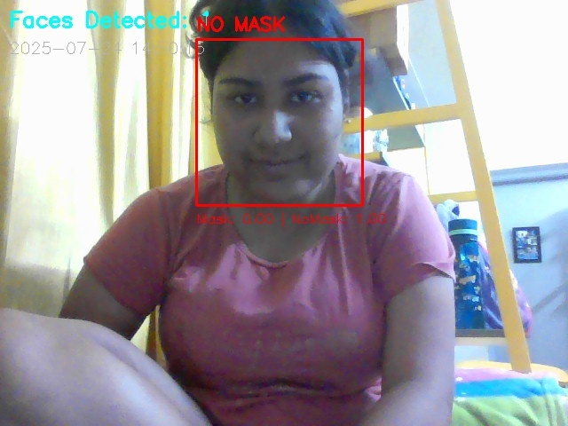
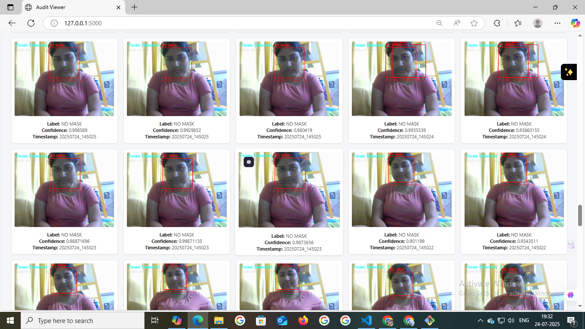

# 🧠 Face Mask Detection using CNN and Flask

This project detects whether individuals are wearing face masks in real-time using a Convolutional Neural Network (CNN) trained with TensorFlow/Keras, integrated with OpenCV and Flask for UI interaction.


# 🎭 Real-Time Face Mask Detection System

A real-time AI-based system that detects whether individuals are wearing face masks using webcam input. The application provides:
- Live visual feedback with bounding boxes
- Voice alerts for violations
- Snapshot logging for audits
- PDF report generation and CSV export

---

## 📂 Project Structure
├── app.py                     # Flask interface using mobilenet_model.h5 ├── mask_detector.py           # Live detection using webcam ├── audit_viewer.py            # Audit dashboard for logged snapshots ├── generate_report.py         # PDF generation from logged data ├── face_mask_project_report.pdf ├── model_training/ │   └── mobilenet_model.h5     # Trained MobileNet model ├── snapshots/ │   ├── webcam_preview.jpg     # Sample webcam detection screenshot │   ├── audit_dashboard.jpg    # Screenshot of dashboard viewer │   └── log.csv                # Saved audit records ├── templates/                 # HTML templates for Flask app ├── utils/ │   ├── alerts.py              # Voice alert logic │   ├── overlay.py             # Drawing functions └── README.md

---

## 🧠 Technologies Used

| Category         | Stack                    |
|------------------|--------------------------|
| Language         | Python                   |
| ML Model         | TensorFlow / Keras       |
| Detection        | OpenCV Haar Cascade      |
| UI               | Flask, HTML              |
| Voice Alerts     | pyttsx3 (TTS)            |
| Storage          | GitHub + Google Drive    |

---

## 🚀 How to Run Locally

### 🔹 1. Install dependencies

```bash
pip install -r requirements.txt
🔹 2. Run detection locally
python mask_detector.py

3. Launch Flask interface
python app.py

Then open: http://127.0.0.1:5000

📸 Application Screenshots
▶️ Live Detection Preview
Webcam Detection
🗂️ Audit Dashboard Viewer
Audit Dashboard

⚠️ Large File Downloads
Due to GitHub limits, some files are hosted externally:
| File Name | Purpose | Download | 
| mobilenet_model.h5 | Used by app.py and mask_detector.py | Download (https://drive.google.com/drive/u/0/folders/1VuB7OBH_8DB2eJb_OkDeDoLghakFFahj)| 

📥 Place these inside: model_training/

📝 PDF Report
Final project report: face_mask_project_report.pdf
Includes model architecture, accuracy, testing screenshots, and code flowcharts.

👤 Author
SRIJA DUTTA
Internship Project — 2025
Bangalore, Jain University , Karnataka,India
GitHub: SRIJADUTTA77

📜 License
This project is for educational and internship purposes. Attribution is appreciated for code reuse or extension.

🏁 Version History
- v1.0 — Initial push with full pipeline
- v1.2 — Enhanced mask_detector.py with buffer logic and MobileNet model
## 📸 Application Screenshots

### ▶️ Live Detection Preview  


### 🗂️ Audit Dashboard Viewer  


## 🚀 Setup

### 1. Python Environment
Ensure Python **3.11.x (stable release)** is installed.

```bash
python -m venv tf_env_final
.\tf_env_final\Scripts\activate